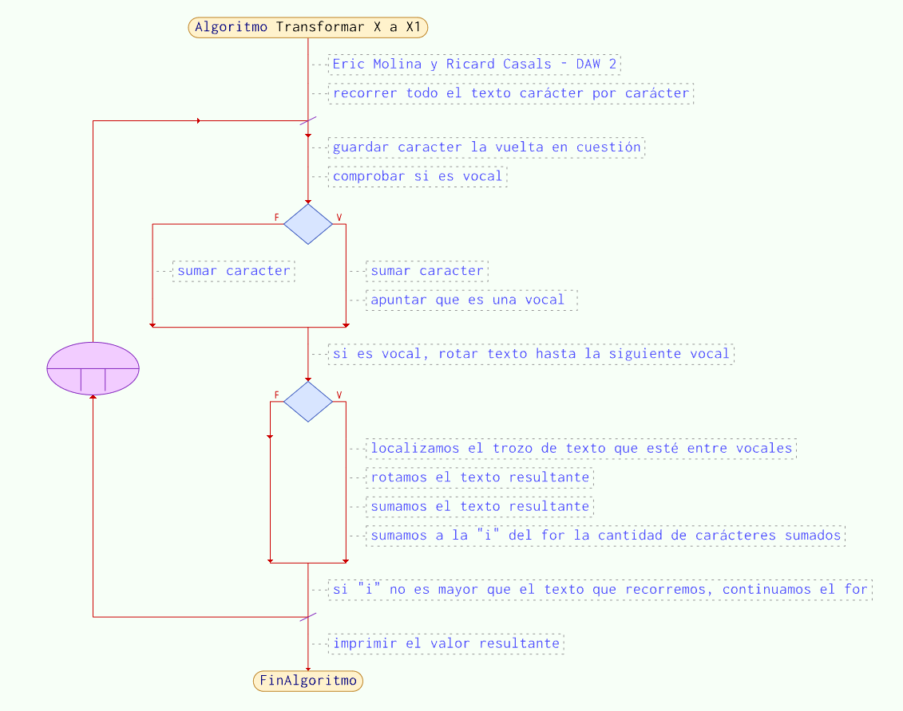
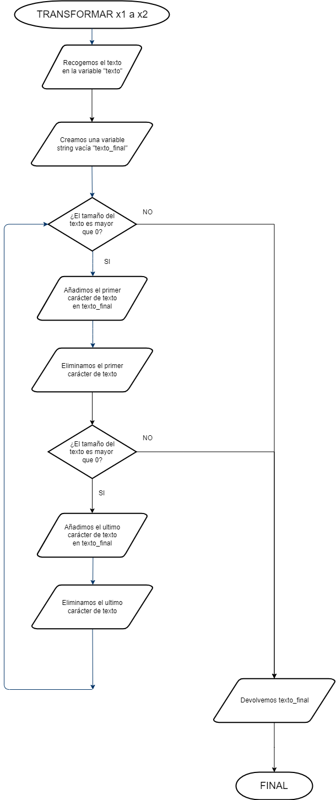

# Problemanum197
## Desarrollado por Eric Molina y Ricard Casals - DAW 2
El trabajo trata de saber desencriptar un texto con diversas reglas, reglas que hemos explicado en los siguientes diagramas. Hemos aprovechado y con el tiempo que nos ha sobrado, hemos hecho también la encriptación, cosa que la primera función (de X a X1) es idéntica, pero la segunda cambia considerablemente.
## ENCRIPTAR
### ESQUEMA X A X1

### ESQUEMA X1 A X2

## DESENCRIPTAR
### ESQUEMA X2 A X1

### ESQUEMA X1 A X

